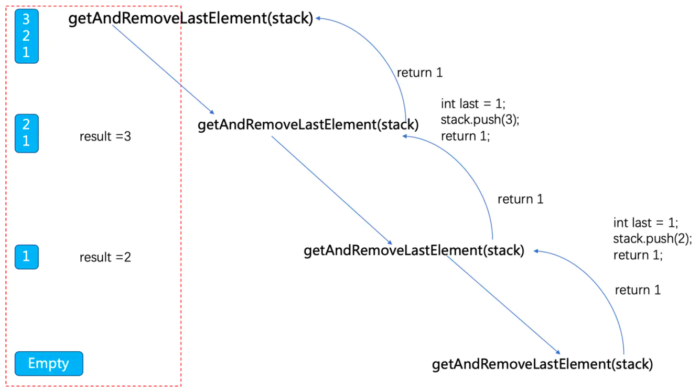

  

# 《僅用Recursive Function Reverse A Stack》
* 利用Recursive 逆序一個stack，不借助別的資料結構。

想法
---
1. 需要把stack 最末端拿出來

訪問Stack最末端

solution 
---

### [Python solution ](./stackQueue.py)

### [C++ solution](./)
