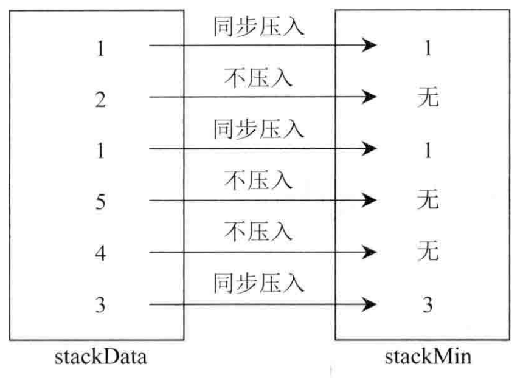
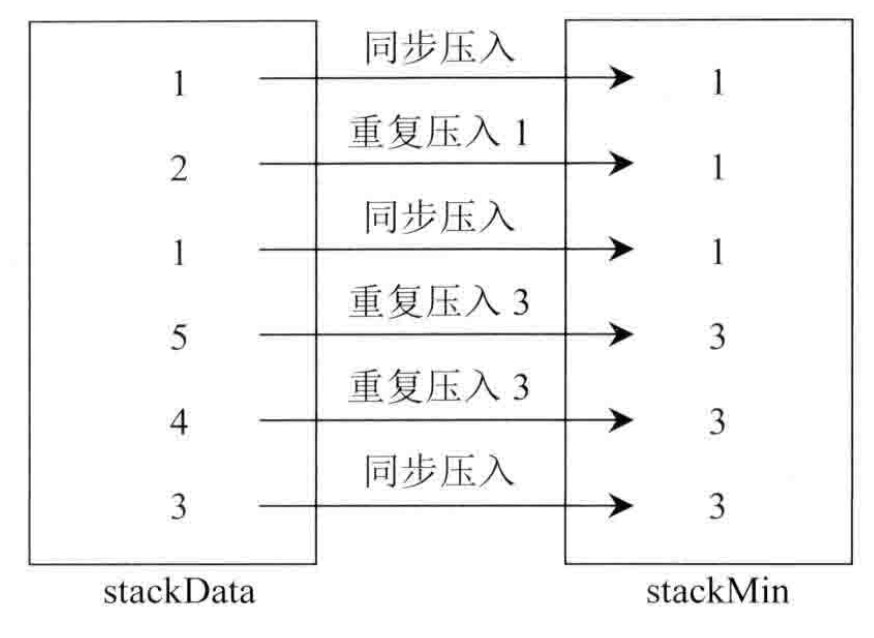

  

# 《設計一個有getMin功能的stack》
* 實現一個stack，可以O(1)時間操作，getMin，top，push，pop

想法
---
使用兩個stack，一個stack存放data，另一個輔助存放Min

**MinStack有兩種做法**

1. 只在min出現時壓入stack

2. 每次push都壓入當前的最小值

solution 
---

### [Python solution ](./stack_and_queue/getMin.py)
### [Python solution 2](./stack_and_queue/getMin2.py)

### [C++ solution](./stack_and_queue/getMin.c)
